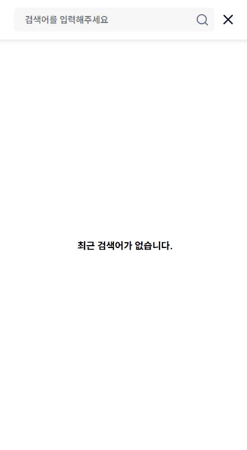

# COLORFUL


<br/>

## Starbucks Store Rebuilding

> 신세계 I&C 스파로스 아카데미  
> 개발기간: 2025-03 ~ 2025.04

<br/>

## 배포 주소

🚀 [https://colorful-starbucks.store](https://colorful-starbucks.store)

<br/>

## 팀원 소개
| 이름 | 역할 |
| ----- | ------- |
| 김호철 | FE(팀장) |   
| 박수아 | FE      |   
| 박준수 | FE      |   
| 정영록 | BE(백엔드 파트 팀장)|   
| 진성오 | BE      |
| 안채원 | BE      |

<br/>

## 프로젝트 소개

스파로스 아카데미 6기, 2조 각양각생팀의 1차 프로젝트인 스타벅스 리빌딩 프로젝트입니다.

<br/>

## 기술 스택

> **Frontend** : JavaScript, TypeScrip, React.js, Next.js, TailwindCSS, Shadcn,
>
> **Backend** : Java, Spring Boot, JPA, QueryDSL, MySQL, Redis,
> Spring Batch, Spring Security, ElasticSearch
>
> **Infra** : AWS, Github Actions
>
> **Communication** : Github, Notion, Swagger, Discord

<br/>

## 시스템 아키텍처


<br/>

## ERD


<br/>

## 시작 가이드

> ### Backend

#### Requirements

```
- Java 17
- Spring Boot 3.4.3
- Spring Data JPA 3.4.3
- Spring Data Security 6.4.3
- Spring Batch 5.2.1
- QueryDSL 5.1.0
- jjwt 0.12.5
- MySQL 9.2
- Redis 7.4.2
- ElasticSearch 8.3.12
  - analysis-nori
```

#### Installation

```bash
$ https://github.com/spharos6th-colorful/BE-colorful-starbucks.git
$ cd BE-colorful-starbucks
$ gradlew build
$ java -jar starbucks-colorful-0.0.1-SNAPSHOT.jar
```

## YML

#### MySQL

```yaml
spring:
    datasource:
        url: { DATABASE_URL }
        username: { DATABASE_USERNAME }
        password: { DATABASE_PASSWORD }
        driver-class-name: com.mysql.cj.jdbc.Driver
```

#### JPA

```yaml
spring:
    jpa:
        hibernate:
            ddl-auto: { value }
            format_sql: { boolean }
        show-sql: { boolean }
```

#### Redis

```yaml
spring:
    data:
        redis:
            host: { REDIS_HOST }
            port: { REDIS_PORT }
            timeout: { REDIS_TIMEOUT }
            repositories:
                enabled: false
```

#### ElasticSearch

```yaml
elasticsearch:
    host: { ELASTIC_SEARCH_HOST }
    port: { ELASTIC_SEARCH_PORT }
```

#### Spring Batch

```yaml
batch:
    job:
        enabled: false
```

> ### Frontend

#### Requirements

```
- node.js 22.14.0
- JavaScript
- TypeScript
- Next.js 15.2.3
- tailwindCSS
- Shadcn
```

#### Installation

```bash
$ git clone https://github.com/spharos6th-colorful/FE-colorful-starbucks.git
$ pnpm install or npm install
$ pnpm run dev or npm run dev
```

<br/>

#### .env

```
BASE_URL=your_api_url
NEXTAUTH_URL= http://localhost:3000
NEXTAUTH_SECRET=your_secret_key
NEXT_PUBLIC_PAYMENTS_KEY=test_your_client_key
```

<br/>

## 폴더 구조

### Backend

```
📂admin
📂auth
 ├─📂application
 ├─📂domain
 ├─📂dto
 │  ├─📂request
 │  └─📂response
 ├─📂infrastructure
 ├─📂presentation
 └─📂vo
     ├─📂request
     └─📂response
📂batch
 ├─📂bestproduct
 └─📂dto
📂cart
📂common
 ├─📂aop
 ├─📂config
 ├─📂entity
 ├─📂exception
 ├─📂jwt
 ├─📂response
 ├─📂s3
 └─📂util
📂coupon
📂delivery
📂event
📂member
📂order
📂payments
📂product
📂search
```

<br/>

### Frontend

```
📂src
 ├─📂actions
 ├─📂app
 ├─📂assets
 ├─📂components
 ├─📂config
 ├─📂context
 ├─📂data
 ├─📂hooks
 ├─📂lib
 ├─📄middleware.ts
 ├─📂provider
 ├─📂schema
 └─📂types
```

<br/>

## 화면 구성
### 로그인

### 메인

### 상품 조회 (무한스크롤)
.gif)
### 상품 상세 조회

### 상품 필터링

### 검색

### 최근 본 상품

<br/>

## 주요 기능

| 구분      | 기능              | 설명                                                                                          |
| --------- | ----------------- | --------------------------------------------------------------------------------------------- |
| 검색      | 검색              | 키워드가 상품명, 카테고리에 속하는 상품들을 커서 기반 페이지네이션 방식으로 조회              |
|           | 검색어 자동 완성  | 검색어 입력 시 상품명 기반 검색어 자동완성                                                    |
| 상품      | 상품 조회         | 카테고리, 가격, 시간 순으로 필터링, 정렬하여 상품 리스트 커서 기반 페이지네이션 방식으로 조회 |
|           | 상품 상세 조회    | 상품에 대한 옵션, 가격, 정보 조회                                                             |
|           | 최근 본 상품      | 사용자가 가장 최근에 본 상품을 플로팅 버튼으로 표시                                           |
|           | 최근 본 상품 조회 | 플로팅 버튼을 클릭하면 날짜별로 최근 본 상품 리스트 조회                                      |
|           | 베스트 상품 집계  | 사용자 주문 데이터를 활용하여 가장 많이 판매된 상품을 카테고리별로 집계                       |
| 주문/결제 | 상품 주문 및 결제 | 유저가 선택한 상품을 토스페이먼츠 API를 활용해 결제하고 주문                                  |

<br/>

## 트러블 슈팅

Backend, Frontend 모두 트러블 슈팅 했던 내용을 노션에 작성해서 팀원들과 공유했습니다.

> ### Backend


<br/>

> ### Frontend

## Git

### 이슈


### 커밋


### PR


## 일정 관리

### 스프린트


### WBS


## API 명세서

## 느낀점

| 이름   | 느낀점 |
| ------ |---------------------------------------------------------------- |
| 정영록   | 이커머스 서비스를 만들어보면서 대용량 트래픽을 감안한 DB 및 아키텍처 설계, 개발 방식에 대해 깊이 생각해보게 된 경험이었습니다. EDA, 카프카와 같이 대규모 서비스에 적용되는 기술들이 왜 필요한지 알게된 좋은 경험이었습니다! 팀원 분들 모두 수고하셨습니다! |
| 진성오   | 처음 접해보는 아키텍쳐들을 하다보니 아주 어려웠으나 좋은 팀원들덕분에 Redis, Elasticsearch와 같은 기술을 처음써봤는데 이 기술들에 대한 깊은 이해와 발표준비를하며 공부를 하며 새로운 기술들도 이해를하며 사용할수있게 되었습니다 우리팀원들 너무 고생많으셨고 프로젝트 잘 마우리 된거같아서 아주 뿌듯하고 기분이 좋습니다! 감사합니다! |  
| 안채원   | 이커머스라는 도메인을 처음 접해, 어려움이 있었는데 팀원들과 함께 고민하며 전체적인 이해와 효율적인 DB설계를 할 수 있었습니다. 또한 Redis, Elasticsearch와 같은 기술을 써봤는데 이 기술들에 대한 깊은 이해와 공부가 필요하다고 느꼈습니다. 각양각색과 함께라서 프로젝트가 잘 마무리 된 것 같습니다! 감사합니다 :-) |
| 박수아   | 대용량 데이터 및 대규모 사용자를 상대로 한 서비스 작업을 처음 겪어보니, hybrid rendering뿐만 아니라 최적화에 대한 생각을 많이 해볼 수 있어서 좋은 경험을 쌓았던 것 같습니다! 팀원분들 모두 수고 많으셨습니다! |
| 김호철   | 프로젝트를 진행하며 단순 기능 구현이나 기술 선택에만 집중하지 않고, 도메인에 대한 깊은 이해와 기술 선택의 근거, 그 이점에 대해 많은 고민을 했습니다. 처음에는 화면 구성만 생각했으나, 점차 렌더링 최적화, 상태 관리, 성능 개선 등 더 깊은 차원의 문제를 고민하게 되었습니다. 이 과정에서 '동작하는' 애플리케이션이 아닌 '효율적으로 동작하는' 애플리케이션을 위한 다양한 접근법을 이용했고, 이는 더 유지보수하기 좋고 사용자 친화적인 제품을 만드는 데 큰 도움이 되었습니다. |
